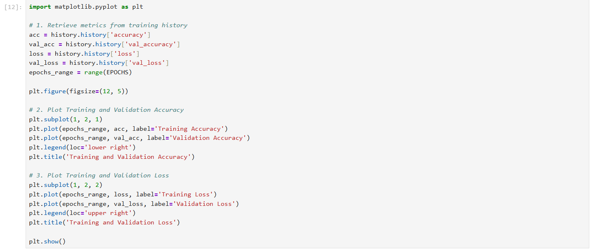
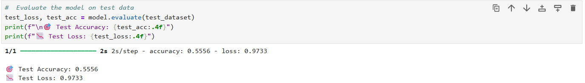
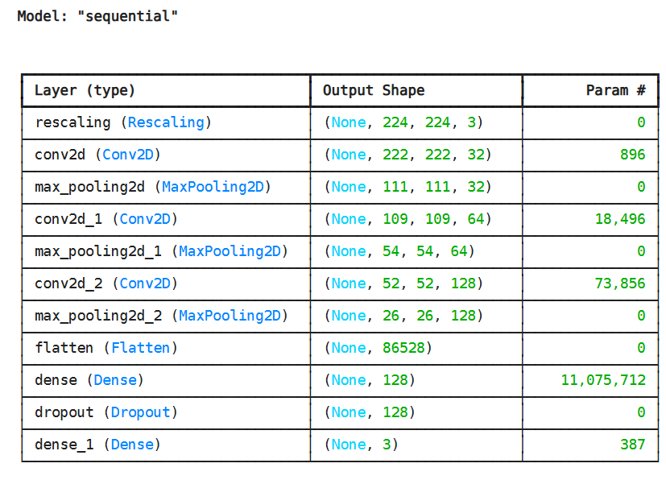

# 🌱 EcoGuardian

EcoGuardian is an AI-powered environmental monitoring system that classifies environmental conditions from images into three categories:

- 🟢 Healthy
- 🟡 Moderate
- 🔴 Poor

In addition to classification, the project introduces an **Environmental Recovery Potential (ERP)** indicator, which estimates how recoverable an area is based on its visual condition.

---

## Project Objective

The goal of EcoGuardian is to support environmental sustainability by providing a simple AI model capable of assessing environmental conditions from images. The system can assist decision-makers in prioritizing restoration efforts and identifying areas that require immediate attention.

---

## Features

- Image classification using Deep Learning
- Three environmental condition classes
- Environmental Recovery Potential (ERP) estimation
- Easy-to-use prediction workflow
- Lightweight implementation suitable for educational projects

---

## Dataset Structure

```
dataset/
│
├── train/
│   ├── Healthy/
│   ├── Moderate/
│   └── Poor/
│
├── validation/
│   ├── Healthy/
│   ├── Moderate/
│   └── Poor/
│
└── test/
    ├── Healthy/
    ├── Moderate/
    └── Poor/
```

---


## Project Workflow

1. Collect environmental images
2. Organize dataset
3. Train CNN model
4. Validate performance
5. Test the model
6. Predict environmental condition
7. Estimate Environmental Recovery Potential (ERP)

---

## 🛠️ Technologies

- Python
- TensorFlow / Keras
- NumPy
- Matplotlib

---

## 💡 Environmental Recovery Potential (ERP)

After classifying an image, the model maps the predicted class to an ERP level to support decision-making:

| Environmental Class | ERP Level | Description / Action Priority |
|----------------------|-----------|-------------------------------|
| Healthy | 🟢 High | Well-preserved. Low priority for restoration. |
| Moderate | 🟡 Medium | Showing signs of degradation. Preventive action recommended. |
| Poor | 🔴 Low | Severely degraded. High priority for urgent restoration. |

---

## 🚀 Installation & Quick Start

### 1. Clone the repository
git clone https://github.com/your-username/EcoGuardian.git
cd EcoGuardian

### 2. Install dependencies
pip install tensorflow numpy matplotlib

### 3. Run the Notebook

Open and execute EcoGuardian.ipynb to train and evaluate the model.

---

## 💻 Prediction & ERP Implementation

Below is the complete prediction code that loads the trained model, predicts the environmental condition of an image, and automatically calculates the Environmental Recovery Potential (ERP):
import numpy as np
import tensorflow as tf

# 1. Load the saved model
loaded_model = tf.keras.models.load_model('EcoGuardian_model.h5')

# 2. Function to predict and estimate ERP
def predict_image_with_erp(image_path):
    # Load and preprocess the image
    img = tf.keras.utils.load_img(image_path, target_size=(224, 224))
    img_array = tf.keras.utils.img_to_array(img)
    img_array = tf.expand_dims(img_array, 0)  # Create batch axis

    # Make prediction
    predictions = loaded_model.predict(img_array)
    score = tf.nn.softmax(predictions[0])

    # Class names and ERP mapping
    class_names = ['Healthy', 'Moderate', 'Poor']
    erp_mapping = {
        'Healthy': 'High (🟢 Low Restoration Priority - Well Preserved)',
        'Moderate': 'Medium (🟡 Preventive Action & Monitoring Recommended)',
        'Poor': 'Low (🔴 High Restoration Priority - Action Required)'
    }

    predicted_class = class_names[np.argmax(score)]
    confidence = 100 * np.max(score)
    erp_status = erp_mapping[predicted_class]

    print("-" * 50)
    print(f"📷 Image: {image_path}")
    print(f"🏷️ Predicted Class: {predicted_class} ({confidence:.2f}% confidence)")
    print(f"🌱 Recovery Potential (ERP): {erp_status}")
    print("-" * 50)

# 3. Test on a sample image
# predict_image_with_erp('dataset/test/Healthy/your_image.jpg')

### Sample Prediction Output

---

## 📈 Model Evaluation & Results

- Test Accuracy: 55.56% (Baseline CNN model trained for 15 epochs).
- Primary Observation: The baseline model shows signs of overfitting due to the limited dataset size. Future iterations will focus on mitigation techniques such as Data Augmentation and Transfer Learning.

### Performance Curves


### Test Set Evaluation

- Test Accuracy: 55.56% (Baseline CNN model trained for **15 epochs**).
- Primary Observation: The baseline model shows signs of overfitting due to the limited dataset size. Future iterations will focus on mitigation techniques such as Data Augmentation and Transfer Learning.

### Model Architecture & Summary


---

## 🔮 Future Improvements

- 🛸 Real-time drone image analysis.
- 🛰️ Satellite imagery integration.
- 🗺️ GIS mapping and localization support.
- 📊 Automated environmental health reporting.
- 📱 Mobile application deployment for field researchers.

---

## Saudi Vision 2030 Alignment

This project supports environmental sustainability and smart technology goals aligned with Saudi Vision 2030, directly contributing to environmental preservation, digital transformation, and the Green Saudi Initiative.

---

## 👤 Author

Manar  
Computer Engineering Student
